# Medusa POS Starter

A lightweight, open-source Point-of-Sale (POS) mobile application for Medusa v2. Built with Expo and React Native, it connects directly to your Medusa Admin REST API for seamless in-store sales.

[](https://opensource.org/licenses/MIT)
[](https://docs.medusajs.com/)
[](https://expo.dev/)

## Try the Demo

Scan the QR code below with Expo Go to try the Medusa POS app on your device:

<div style="max-width: 200px;">


</div>

## Screenshots

<div style="display: flex; flex-wrap: wrap; gap: 10px; justify-content: center;">
  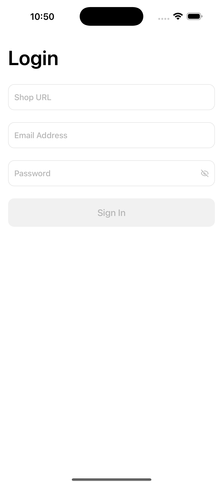
  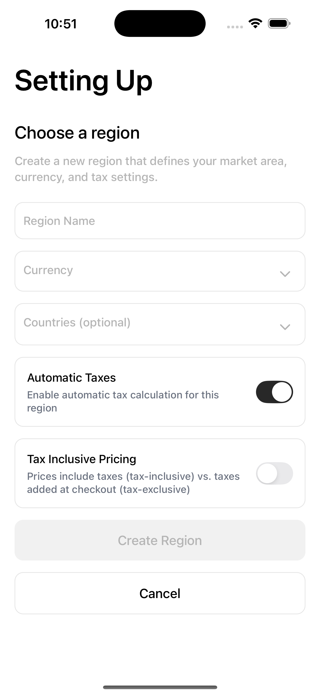
  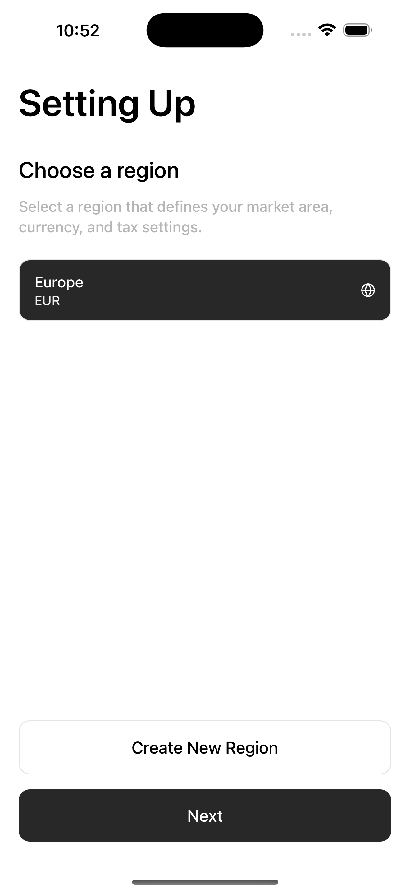
  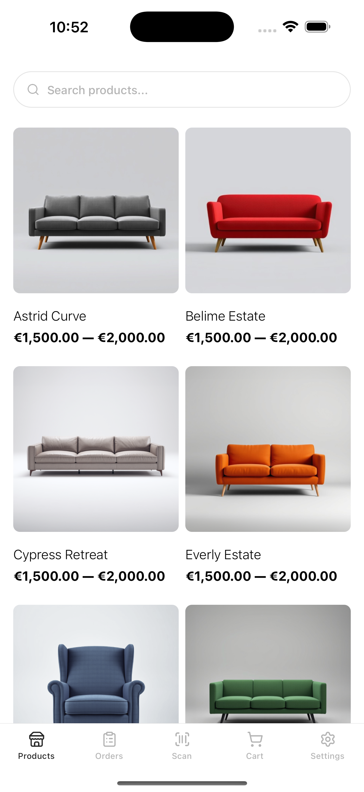
  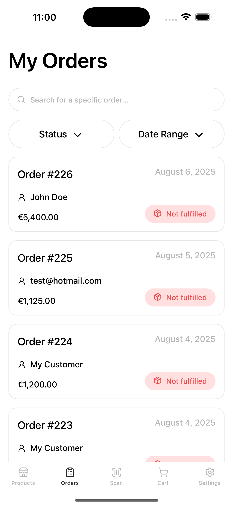
  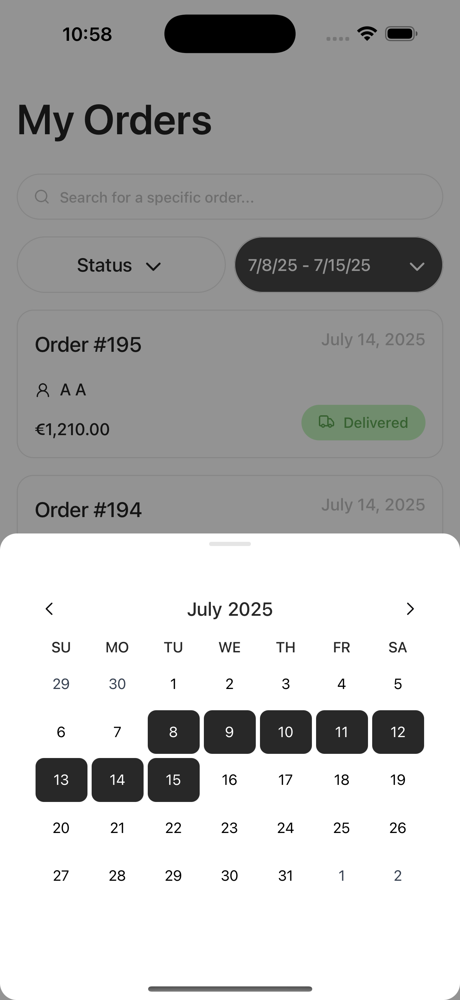
  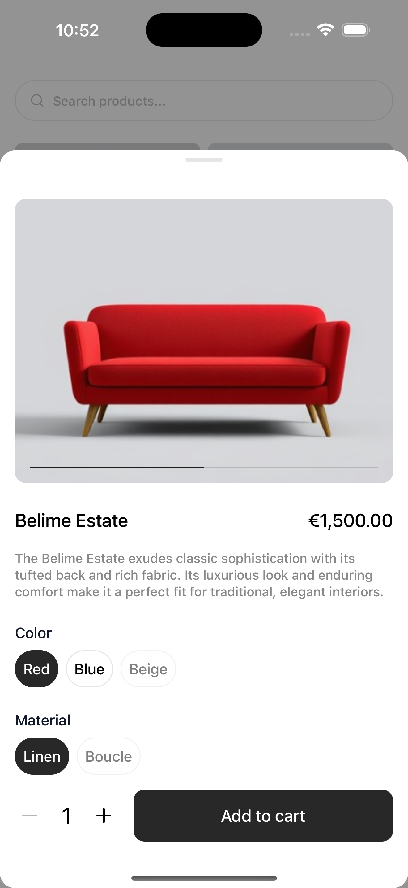
  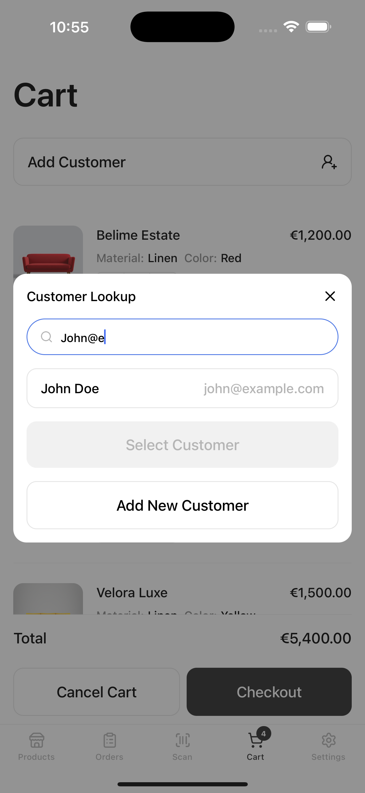
  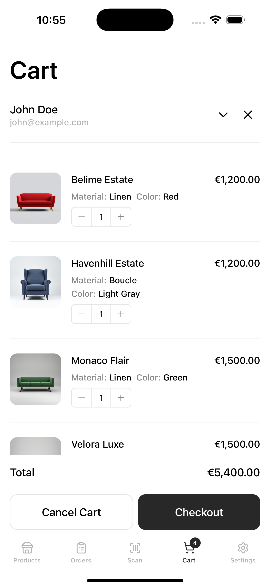
  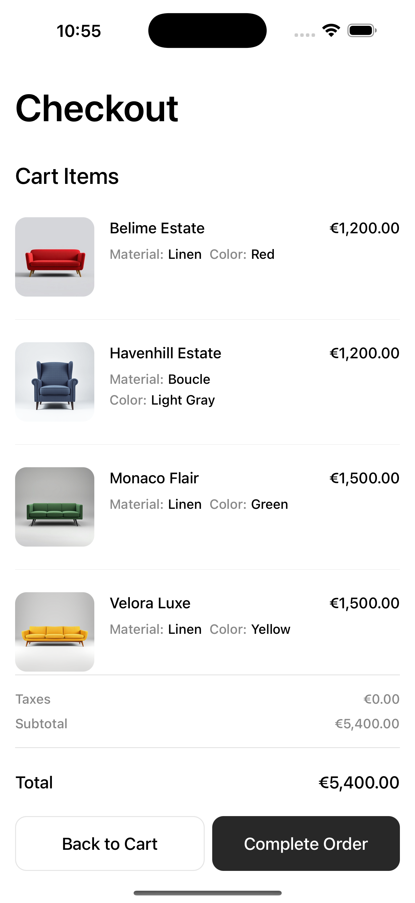
  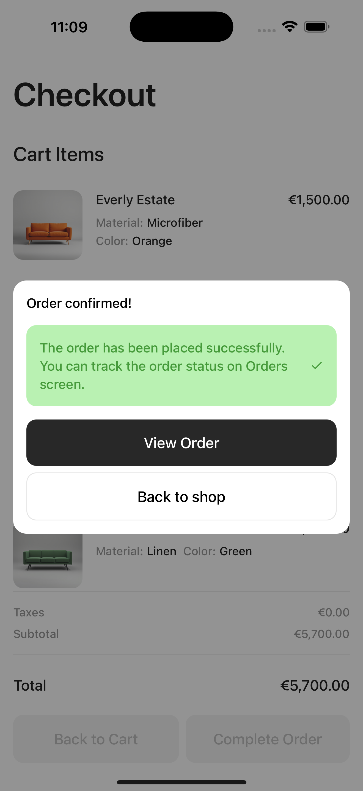
  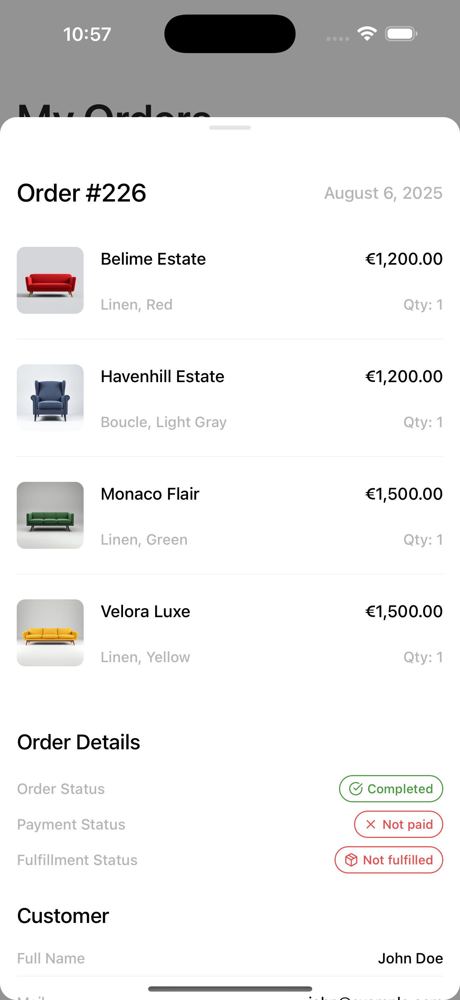
</div>

## Overview

Medusa POS brings retail operations to your mobile device without backend changes. Store clerks can scan products, manage carts, attach customers, and complete orders. All of this is powered by your existing Medusa setup.

Perfect for fast-paced retail environments, this starter helps you extend headless commerce into physical stores with minimal setup.

## Features

- **Secure Authentication**: Log in with Medusa admin credentials.
- **Setup Wizard**: Configure regions, sales channels, and stock locations on first launch.
- **Product Discovery**: Search products by name or scan barcodes using device camera.
- **Cart Management**: Create draft orders, add items, apply discounts, and attach customers.
- **Checkout Flow**: Complete orders directly from the app.
- **Order History**: View past orders with filtering and details.
- **Settings**: Change sales channel, region, and stock location; log out from the app.
- **Responsive Design**: Optimized for tablets and smartphones running iOS 15+ or Android 11+.

## Prerequisites

- Node.js 18+
- npm
- A Medusa v2 backend with Admin REST API accessible via HTTPS
- At least one Admin user account
- Device with rear-facing camera for barcode scanning

## Quickstart

1. **Clone the repository**:
   ```bash
   git clone https://github.com/Agilo/medusa-pos-starter.git
   cd medusa-pos-starter
   ```

2. **Install dependencies**:
   ```bash
   npm install
   ```

3. **Start the development server**:
   ```bash
   npm start
   ```

For detailed setup, see the [Expo documentation](https://docs.expo.dev/).

## Contributing

We welcome contributions from the community to help improve Medusa POS! Whether you're fixing bugs, adding features, or improving documentation, your input is valuable.

### How to Contribute

1. **Fork the repository** and create a feature branch from `master`.
2. **Open an issue** ([GitHub Issues](https://github.com/Agilo/medusa-pos-starter/issues)) first to discuss your idea or report a bug.
3. **Submit a pull request** ([Pull Requests](https://github.com/Agilo/medusa-pos-starter/pulls)) with a clear description of changes.
4. Ensure your code follows our style guidelines and includes tests where applicable.

### Guidelines

- We only merge PRs that benefit the general use of the POS. Specific customizations for individual needs will not be merged to maintain codebase integrity.
- Follow the existing code style and conventions.
- Write clear, concise commit messages.
- Test your changes thoroughly.

## FAQ

### Can I use this with my existing Medusa store?

Absolutely! Medusa POS is designed to work with any standard Medusa v2 store without backend modifications. Just connect via the Admin API.

### What is the minimum Medusa version required?

Medusa POS requires Medusa v2. It integrates directly with the Medusa Admin REST API, so ensure your backend is running Medusa v2 or later.

### Why can't I use an HTTP Medusa URL?

For security reasons, Medusa POS requires a secure HTTPS connection to your Medusa backend. HTTP connections are not supported to ensure data protection and compliance with modern security standards.

### How is payment handled?

Medusa POS currently focuses on order management without integrated payment processing in the MVP. We're developing a payment screen that will support cash payments using Medusa's manual payment plugin. Additionally, we're working on plugins and integrations with Stripe and Adyen payment terminals for seamless POS transactions.

### Is offline mode supported?

Full offline mode is not supported in the current version. The app requires a network connection to create new orders or sync data. However, we cache Medusa responses locally, allowing you to browse previously loaded products and orders even without an internet connection.

### How do I distribute the app?

We'll soon publish Medusa POS to the App Store and Google Play Store for easy access. If you have special distribution needs or require a customized app, Agilo offers professional services to help. We've already deployed several POS apps in production. Reach out to us for tailored solutions.

### Can I customize the app?

Yes, you're free to fork the repository and make your own customizations. Additionally, Agilo provides professional customization services for Medusa POS, including UI/UX adjustments, integrations with hardware (like barcode scanners or printers), and connections to other systems (ERPs, inventory management, etc.). For specific customizations, contact us at [Agilo](https://www.agilo.com/contact/) to discuss your needs.

### What PRs will be merged?

We welcome contributions that benefit the general use of Medusa POS, such as bug fixes, performance improvements, or new features applicable to most users. Pull requests for specific customizations or client-specific changes will not be merged to keep the core codebase maintainable.

### How do I report bugs or request features?

Open an issue on our [GitHub repository](https://github.com/Agilo/medusa-pos-starter/issues) with details about the bug or feature request. For urgent matters, contact us directly.

### Can I contribute to the project?

Yes! Check our Contributing section above for guidelines. We appreciate code contributions, documentation improvements, and community feedback.

## License

Licensed under the [MIT License](https://github.com/Agilo/medusa-pos-starter/blob/master/LICENSE).

---

Built with ❤️ by [Agilo](https://www.agilo.com/) for the Medusa community.
